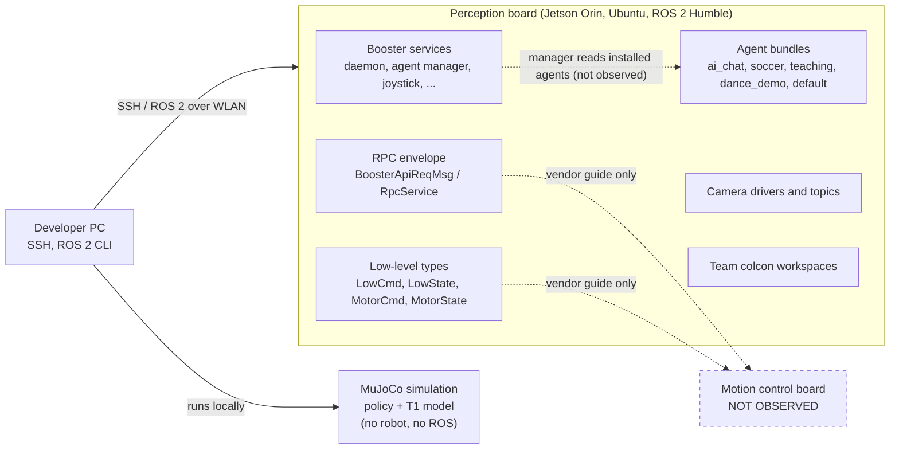

---
doc:
  quadrant: explanation
  verified_on: "2026-09-22"
  status: partial
---
# System architecture of the T1 (example page)

An overview of how the Booster T1's software is put together, written so that a newcomer knows what runs where and which interfaces exist. It is deliberately limited to what has been observed on one robot; everything else is listed under [Gaps](#gaps) instead of being guessed.

**Source line.** Observations on one T1 (perception board, firmware T1 2.3.4, ROS 2 Humble): first access session 2026-09-08, RPC and agent survey 2026-09-15, camera session 2026-09-22; MuJoCo checks 2026-10-02. Nothing was observed on the second computer (motion control board).

## 1. Scope

The T1 is used here as a platform for RoboCup @Home. This page explains the structure of its onboard software and the interfaces a developer meets first. It does not explain how to drive the robot; the how-to and reference pages do.

## 2. Context

Three parties interact with the robot software:

- **Developer machine.** Reaches the robot over the wireless network by SSH and ROS 2 tools. A separate, robot-free path is the MuJoCo simulation of the walking policy (see the how-to page "Run the T1 locomotion policy in MuJoCo").
- **Vendor software on the robot.** Services that start at boot, including the agent manager.
- **Team software on the robot.** Tech United's own RoboCup software is installed as several parallel colcon workspaces in the robot user's home directory. It is maintained inside the team and is not described here.

## 3. Building blocks

The solid arrow is observed. Dashed lines are links that were not observed: they come from names or from the vendor guide only, and the vendor guide was written for an older system image.

| Block | What was observed | Reference |
|---|---|---|
| Two computers | The T1 contains two separate computers. The one inspected is a Jetson Orin with `aarch64` Ubuntu and ROS 2 Humble. | the hardware reference page |
| Booster services | Running at boot: `booster-agent-manager`, `booster-battery-daemon`, `booster-btmon`, `booster-daemon-perception`, `booster-daemon`, `booster-update-engine`, `joystick_ros2` (2026-09-08). | the command cheatsheet |
| Software layout | Vendor software lives under `/opt/booster/` (directories include `BoosterRos2`, `BoosterRos2Interface`, `Gait`, `RobotCore`, `RemoteController`, `BoosterShell`, `Tools`, `configs`). | the hardware reference page |
| RPC envelope | One generic request type with `api_id` and `body`, and a service `RpcService`. | the RPC API reference page |
| Low-level interface | A separate message family (`LowCmd`, `LowState`, `MotorCmd`, `MotorState`). Topics `/low_state`, `/joint_ctrl`, `/odometer_state`, `/head_pose` exist. | the RPC API reference page |
| Agent system | Five installed agent bundles and an on-disk layout managed by a service. | the agent plugin system reference page |
| Camera | Depth camera (RealSense D455) with several image topics. | the camera topics reference page |
| Network | The perception board has two wired interfaces and one wireless interface; both CAN interfaces were down. | the getting-started tutorial |
| Simulation | Walking policy: MLP, 47 inputs, 12 outputs, 50 Hz policy and 500 Hz physics in MuJoCo, running in a single process. | the MuJoCo how-to |

## 4. Interface layers

1. **Low-level joint interface.** Typed messages for motor commands and states. A walking policy such as the one in the simulation consumes joint state and emits joint targets; whether the factory walking controller is of that kind is not known.
2. **RPC envelope.** A generic `api_id` plus JSON-like `body` call format shared by the per-domain request topics. What each `api_id` does is not known to us.
3. **Agents.** Packaged robot-side applications installed by a manager service.

The first two are different message families, so they are separate layers. How the third relates to the RPC layer is not established.

> [!warning] Live command paths
> `*ApiTopicReq` topics and `RpcService` are command paths into the robot. Do not publish or call them without knowing exactly what they do.

## Gaps

> [!info] Not observed, so not claimed
> - Everything about the motion control board: its services, which board carries motor communication, and over which bus. Both CAN interfaces on the perception board were down when listed.
> - Whether the RPC request topics carry the same envelope as `RpcService`, and which process serves them.
> - The robot modes (damping, preparation, walking, custom) are described in the vendor manual but were not tested by us, so they are not described here.
> - How a custom agent would be installed and whether that is supported.
> - Bridge between simulation and robot: sources disagree on topic names for a real-robot deployment of the policy, and none was tested.
